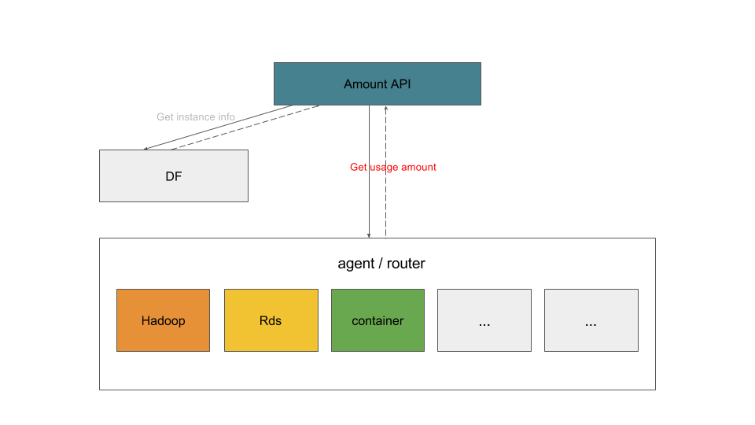

## Restart instance API


仅仅支持容器实例的重启。

```
PUT /sapi/v1/namespaces/:name/instances/:instance_name
```

### 路径参数

<table>
    <tr>
        <td>参数名</td>
        <td>描述</td>
    </tr>
    <tr>
        <td>name</td>
        <td>namespace 名称</td>
    </tr>
    <tr>
        <td>instance_name</td>
        <td>服务实例名称</td>
    </tr>
</table>

### API响应

* HTTP code: 200
* Content-Type: application/json


### 示例

```
PUT /sapi/v1/namespaces/san/instances/hbase-instance
```
```json
{
  "code": 200,
  "message": ""
}
```


## Amount API

Amount API 由前端／适配器调用，返回某个服务实例的资源统计信息。


业务基本流程：amount API先从DF获取到instance的服务类型等信息，然后从对应的Agent获取用量并返回。

```
GET /sapi/v1/namespaces/:name/instances/:instance_name
```

### 路径参数

<table>
    <tr>
        <td>参数名</td>
        <td>描述</td>
    </tr>
    <tr>
        <td>name</td>
        <td>namespace 名称</td>
    </tr>
    <tr>
        <td>instance_name</td>
        <td>服务实例名称</td>
    </tr>
</table>

### API响应

* HTTP code: 200
* Content-Type: application/json

<table>
    <tr>
        <td>名称</td>
        <td>描述</td>
        <td>类型</td>
    </tr>
    <tr>
        <td>items</td>
        <td>资源用量指标列表</td>
        <td>用量指标数组</td>
    </tr>
</table>

### 用量指标

<table>
    <tr>
        <td>名称</td>
        <td>描述</td>
        <td>类型</td>
    </tr>
    <tr>
        <td>*name</td>
        <td>指标名称</td>
        <td>字符串</td>
    </tr>
    <tr>
        <td>*used</td>
        <td>指标已使用量</td>
        <td>字符串</td>
    </tr>
    <tr>
        <td>size</td>
        <td>指标配额</td>
        <td>字符串</td>
    </tr>
    <tr>
        <td>available</td>
        <td>指标可用配额</td>
        <td>字符串</td>
    </tr>
    <tr>
        <td>desc</td>
        <td>指标描述</td>
        <td>字符串</td>
    </tr>
</table>

 **带*号为必需返回字段，其他为可选项。**

 ### 示例

```
GET /sapi/v1/namespaces/san/instances/hbase-instance
```
```json
{"items":[
    {"name":"RegionsQuota","size":"500","used":"300","available":"200","desc":"HBase命名空间的region数目"},
    {"name":"TablesQuotaa","size":"100","used":"20","available":"80","desc":"HBase命名空间的表数目"}
]}
```

## agent / route

agent 当前由三个单独模块来实现，分别对应rds，hadoop，container三个类型的服务用量。

## rds

```
GET /svc/v1/rds/:name/db/:dbname
```
### 路径参数

<table>
    <tr>
        <td>参数名</td>
        <td>描述</td>
    </tr>
    <tr>
        <td>name</td>
        <td>rds提供的服务。当前仅有mongo，gp。</td>
    </tr>
    <tr>
        <td>dbname</td>
        <td>数据库名</td>
    </tr>
</table>

### API响应

* HTTP code: 200
* Content-Type: application/json

json消息体与Amount API返回的一样。


## hadoop

```
GET /svc/v1/hadoop/:name/instanace/:instanceId
```
### 路径参数

<table>
    <tr>
        <td>参数名</td>
        <td>描述</td>
    </tr>
    <tr>
        <td>name</td>
        <td>hadoop broker提供的服务，包括Hive，HBase, Hive, MapReduce, Spark, Kafka。</td>
    </tr>
    <tr>
        <td>instanceId</td>
        <td>服务实例的id。</td>
    </tr>
</table>

### API响应

* HTTP code: 200
* Content-Type: application/json

json消息体与Amount API返回的一样。

## container

```
GET /svc/v1/container/:name/instance/:instance_name
```

### 路径参数

<table>
    <tr>
        <td>参数名</td>
        <td>描述</td>
    </tr>
    <tr>
        <td>name</td>
        <td>容器类型服务，neo4j，rmq等。</td>
    </tr>
    <tr>
        <td>instance_name</td>
        <td>服务实例名称</td>
    </tr>
</table>

### API响应

* HTTP code: 200
* Content-Type: application/json

json消息体与Amount API返回的一样。
